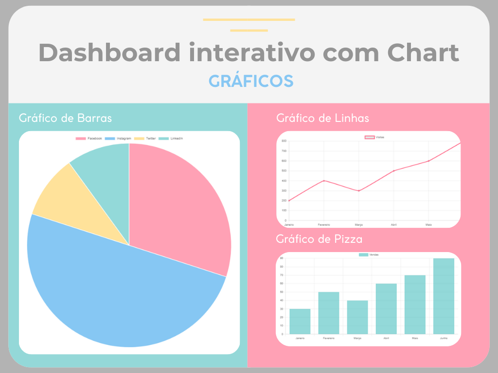

# Dashboard Interativo em JavaScript

Bem-vindo ao projeto de **Dashboard Interativo**! Este repositório contém uma aplicação web que utiliza JavaScript puro (Vanilla JS) e a biblioteca Chart.js para criar visualizações dinâmicas e interativas de dados.

 

## Descrição do Projeto

O objetivo deste projeto é desenvolver um dashboard que permita a visualização de dados em tempo real de forma intuitiva. Utilizando três tipos diferentes de gráficos, a aplicação proporciona uma maneira eficaz de apresentar informações e facilitar a análise de dados.

### Funcionalidades

- **Gráficos Interativos:** Utiliza Chart.js para renderizar gráficos interativos que respondem a interações do usuário.
- **Três Tipos de Gráficos:**
  - **Gráfico de Linhas:** Ideal para mostrar tendências ao longo do tempo.
  - **Gráfico de Barras:** Perfeito para comparações entre categorias.
  - **Gráfico de Pizza:** Útil para visualizar a distribuição percentual de um total.

## Tecnologias Utilizadas

- **JavaScript (Vanilla JS):** Para a estruturação da lógica da aplicação.
- **HTML/CSS:** Para a criação da interface do usuário.
- **Chart.js:** Biblioteca leve e poderosa para gráficos em JavaScript.
